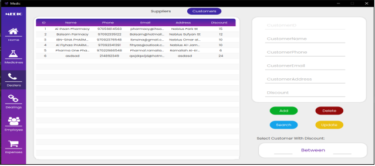

# Medic

The medicine warehouse is the place where medicines from different
categories are stored .In this project, we have developed an
application that serves as a comprehensive management system for a
medicine warehouse. The warehouse is the central storage location
for medicines belonging to various categories. The application
provides an intuitive interface that enables the warehouse manager
to oversee the entire program. It includes features like managing
orders, supplies, expenses, dealers, etc. The manager can easily add,
modify, delete, and search all of the available information using the
application.

## Introduction

in this project, we built a desktop program application named “Medic”
that uses a database to store everything about the medicine warehouse
like drugs(medicines), categories, employees, dealings, dealers, and
expenses. And, the manager of the warehouse can create and have an
account to control the whole program easily.
We designed multiple user-friendly interfaces, enabling the warehouse
manager to effortlessly navigate and control the application. To achieve
this, we used Scene Builder and applied CSS styling for an enhanced user
experience. To connect the interfaces with the database we did use
JDBSC along with driver manager Postgres.
The manager can access the system through a username and password.
Once logged in, he/she can easily navigate between sidebar tabs.
Furthermore, the manager can add a new medicine, and keep track of
orders and supplies associated with it, including information about
dealers. Additionally, he/she can generate a report encompassing all
medicines in the warehouse.
The manager has the ability to generate a comprehensive order bill
report, encompassing all details related to the order, such as information
about the medicine, the amount, the dealer involved, and the total cost.
The manager can manage everyone working in the warehouse and
decide if they're a medicine distributor or a regular worker. Medicine
distributors might get extra rewards for delivering stuff.
In addition, he/she can add and track all of the expenses in the
warehouse and specify their amount, also. See the total amount of all
expenses on screen or in the report.

## Project Requirments

The warehouse houses a variety of medicines, each of which is
characterized by its unique MedicineID, Brand Name, Scientific Name,
unit, Expiration Date, Available Quantity, Price Before Tax, and Tax
Percentage.
We keep track of the category that the medicine is in and each category
has a CategoryID, CategoryName, and Description.
Our employee database includes essential details for each employee, such
as SSN, name, birthdate, hourly salary, and gender. We also have a
specialized employee type known as "Medicine Distributors." They
distribute orders to customers and receive bonuses based on a Bonus
Percentage.
The manager of the warehouse can change the bonus percentage of
medicine to any medicine distributor. (functional requirements)
In our database, we store Dealings, each uniquely identified by an ID and
date, with a "Paid" or "UnPaid" status. These Dealings further break down
into Supplies, typically initiated by Suppliers and each has a special cost,
and Orders, which are typically created by Customers, and we closely store
the payment method for each Order, whether it's cash or check.
we can ensure if the order is urgent or not (if the date of the order is the
same as the date of the day then it’s urgent). (functional requirements)
We keep track of the medicines that have been ordered and also we keep
track of the medicines that have been supplied to our warehouse.
We store dealer information within "Dealer" records, each assigned a
unique ID, and include essential contact details like Email, Address, and
Phone Number. These Persons are categorized into two key groups:
Customers, who possess names and lists of dealings of type medicine
orders (potentially with discounts), and Suppliers, responsible for making
dealings of type supplies to supply our warehouse, distinguished by their
local or global supply scope.
Additionally, our database includes the storage of Expenses linked to our
warehouse. Each Expense is assigned a unique ID and features a distinct
expense type, payment date, and the corresponding money amount.
Furthermore, there is a brief description of each expense.
The manager of the warehouse can know the total amount of the
warehouse’s expenses.

## Tools Used

- Pgadmin: the DBMS program we used to create our database and
  control it
- Intellij idea community: this program is used for writing Java
  codes
- Jdk 20
- JDBC 11: the library in Java we used to connect the database to
  the application
- JavaFx
- CSS
- SceneBuilder: the program we used to create GUI interfaces
- Glyph: the library we used for inserting icons
- JasperSoft Studio: the program we used to create and design
  reports
- Draw.io: the program we used to draw the UML, crows fot
  notation.

## Project UML

## GUI Work

## Report Output

## Conclusion

Medic is a desktop application that manages medicine inventory. It
assigns unique IDs to medicines, categorizes them, and links them to
orders and supplies.
In this project, we learned how to build entity-relationship and UML
models from requirements using software program draw.io. We also
learned how to convert the entity-relationship model to relational
mapping using the same software.
Then , we learned how to write DDL SQL statements to create our
database for the application, and DML statements for inserting records
into the database, we used the PgAdmin program to deal with SQL
statements.
We learned how to use the Scene Builder software to create interfaces
and connect them using JavaFX. We also learned how to style our
application using CSS in conjunction with JavaFX.
In addition, we connected the interfaces to a database using JDBC in
our course. JDBC connects DriverManager PostgreSQL to a Java
application.
Finally, we learned how to use Jaspersoft Studio to create and design
reports for the warehouse and generate them within interfaces.
In conclusion, DBMS technology is a powerful tool for storing,
retrieving, and searching data. It is essential to have a strong database
when building a user interface, as the GUI is useless without it.
